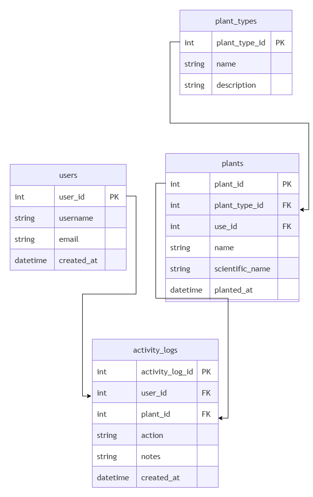

<div align="center">

# 🌱 Tabulampot

**Aplikasi Monitoring dan Manajemen Perawatan Tanaman Buah dalam Pot**


</div>

---

## 📖 Deskripsi

Pemilik tabulampot sering lupa jadwal penyiraman, terlambat memupuk, dan tidak punya catatan riwayat perawatan tanaman — akibatnya pertumbuhan tanaman kurang optimal.

**Tabulampot** membantu mencatat aktivitas perawatan tanaman secara digital dan menghitung jadwal perawatan berikutnya secara otomatis, berdasarkan jenis tanaman dan riwayat aktivitas terakhir.

> 📅 Fitur kalender perawatan visual bersifat **opsional**, akan ditambahkan menyesuaikan progress.

---

## 👥 Anggota Kelompok

| Nama | Peran | Tugas |
|---|---|---|
| Andreas Fiki Darmawan| Frontend | UI/UX, komponen SvelteKit, integrasi API |
| Panji Cahya prasetyo| Backend | REST API, database, autentikasi (JWT & bcrypt) |

---

## 🗂️ Struktur Repository

```
Tabulampot/
├── frontend/     → SvelteKit (lihat frontend/README.md)
├── backend/      → Express.js + Drizzle ORM (lihat backend/README.md)
└── README.md     → dokumen ini
```

---

## 🗃️ Skema Database

```
users
  │
  └── plants
        │
        ├── plant_types    (referensi jenis & interval perawatan)
        └── activity_logs  (riwayat penyiraman & pemupukan)
```

| Tabel | Deskripsi |
|---|---|
| `users` | Data akun pengguna |
| `plant_types` | Master jenis tanaman & interval penyiraman/pemupukan |
| `plants` | Tanaman milik pengguna |
| `activity_logs` | Riwayat aktivitas per tanaman — dibedakan lewat kolom `activity_type` (`watering` / `fertilizing`) |


---

## 🔌 Dokumentasi API

| Method | Endpoint | Payload Body | Format Respons |
|---|---|---|---|
| `POST` | `/register` | `{ "name": "Panji", "email": "panji@gmail.com", "password": "123456" }` | `{ "message": "Register berhasil" }` |
| `POST` | `/login` | `{ "email": "panji@gmail.com", "password": "123456" }` | `{ "token": "..." }` |
| `GET` | `/dashboard` | – | `{ "totalPlants": 1, "needWatering": , "needFertilizing":  }` |
| `GET` | `/plant-types` | – | `{"id":1,"name":"Mangga","wateringInterval":3,"fertilizingInterval":30,"description":"Mangga Harum Manis","createdAt":"2026-07-13T11:46:24.000Z"},{"id":2,"name":"Jambu","wateringInterval":2,"fertilizingInterval":21,"description":"Jambu Kristal","createdAt":"2026-07-13T11:46:24.000Z"},{"id":3,"name":"Jeruk","wateringInterval":2,"fertilizingInterval":14,"description":"Jeruk Nipis","createdAt":"2026-07-13T11:46:24.000Z"}` |
| `GET` | `/plants` | – | `{"id":2,"userId":1,"plantTypeId":1,"nickname":"Mangga Depan Rumah","plantingDate":"2026-07-13T00:00:00.000Z","location":"Teras","notes":"Bibit umur 3 bulan","createdAt":"2026-07-13T10:52:28.000Z","updatedAt":"2026-07-13T10:52:28.000Z"}` |
| `POST` | `/plants` | `{ "plantTypeId": 1, "nickname": "Mangga Depan Rumah", "plantingDate": "2026-07-13T00:00:00.000Z", "location": "Teras", "notes": "Bibit umur 3 bulan", "createdAt":"2026-07-13T10:52:28.000Z","updatedAt":"2026-07-13T10:52:28.000Z" }` | `{ "message": "Tanaman berhasil ditambahkan" }` |
| `PUT` | `/plants/:id` | `{ "nickname": "Mangga Belakang Rumah" }` | `{"message":"Tanaman berhasil diupdate"}` |
| `DELETE` | `/plants/:id` | – | `{ "message": "Tanaman berhasil dihapus" }` |
| `POST` | `/plants/:id/water` | `{"notes":"Disiram pagi"}` | `{"message":"Penyiraman berhasil dicatat"}` |
| `POST` | `/plants/:id/fertilize` | `{"notes":"Pupuk NPK"}` | `{"message":"Pemupukan berhasil dicatat"}` |
| `GET` | `/plants/:id/history` | – | `{"id":3,"plantId":2,"activityType":"fertilizing","activityDate":"2026-07-15T13:40:29.000Z","notes":null,"createdAt":"2026-07-15T20:40:29.000Z"},{"id":2,"plantId":2,"activityType":"watering","activityDate":"2026-07-15T13:39:41.000Z","notes":null,"createdAt":"2026-07-15T20:39:41.000Z"}` |

<!-- 🔧 PLACEHOLDER: isi kolom Payload Body & Format Respons begitu endpoint backend selesai diimplementasi -->

---

## ▶️ Cara Menjalankan Secara Lokal

**Frontend**
```bash
cd frontend
npm install
npm run dev
```

**Backend**
```bash
cd backend
npm install
npm run dev
```

Salin `.env.example` menjadi `.env` di masing-masing folder sebelum menjalankan.

<!-- 🔧 PLACEHOLDER: tambahkan environment variable yang dibutuhkan setelah backend selesai -->
